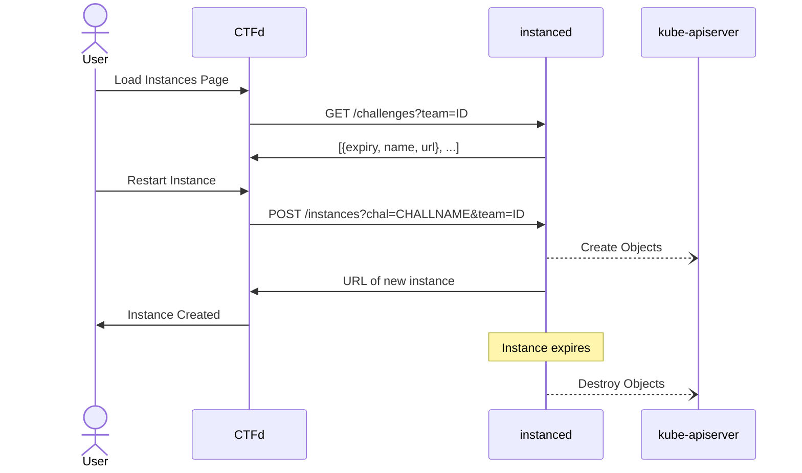

# ubcctf/instanced

currently Jank As Hell.

Manages challenge instances on-demand.

`instanced` runs in the cluster and exposes an HTTP API which is used to request instances.
Challenge templates are added in the form of CRDs. Example format is in this repository.
`instanced` must be restarted every time new CRDs are applied.

Instances created are kept track of in a local sqlite database. The instancer periodically scans the database for expired instances and deletes them.

- GET `/instances` - get list of active instances
- GET `/challenges?team=$ID` - get list of available challenges and instance states for specific team
- POST `/instances?chal=$CHALLNAME&team=$ID` - provision an instance for specific challenge and team
- DELETE `/instances?id=$ID` - delete challenge with id

