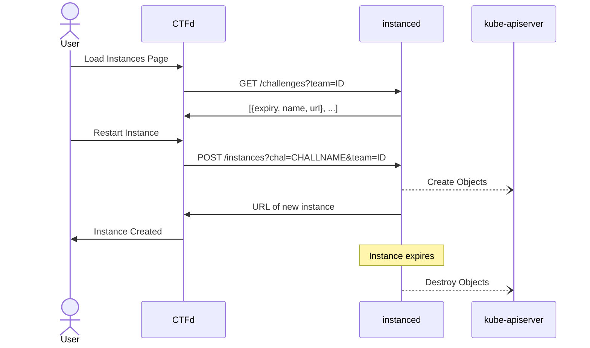

# ubcctf/instanced
NOTE: this was written for maplectf 2023, while it is functional, it is not ready for use out of the box.

Manages challenge instances on-demand.

`instanced` runs in the k8s cluster and exposes an HTTP API which is used to request instances.
Challenge templates are added in the form of CRDs or config. Example format is in this repository.
`instanced` must be restarted every time new CRDs are applied.

Instances created are kept track of in a local sqlite database. The instancer periodically scans the database for expired instances and deletes them.

## Instancer CLI tool
The instancer cli tool has been installed to the bastion.
```
maple@bastion:~$ instances
Instancer Admin CLI

Syntax: instances COMMAND [params]
Commands:
  help                                Print this help.
  list                                list all active instances.
  chals                               Show available challenges.
  chals  [CTFD TEAM ID]               Show challenge statuses for a team.
  create [CTFD TEAM ID] [CHAL KEY]    create a new challenge instance.
  delete [INSTANCE ID]                delete an instance.
  purge                               purge all instances.
```


## API
- GET `/instances` - get list of active instances
- GET `/challenges` - get available challenge types
- GET `/challenges?team=$ID` - get list of available challenges and instance states for specific team
- POST `/instances?chal=$CHALLNAME&team=$ID` - provision an instance for specific challenge and team
- DELETE `/instances?id=$ID` - delete challenge with id
- DELETE `/instances` - delete all challenges



